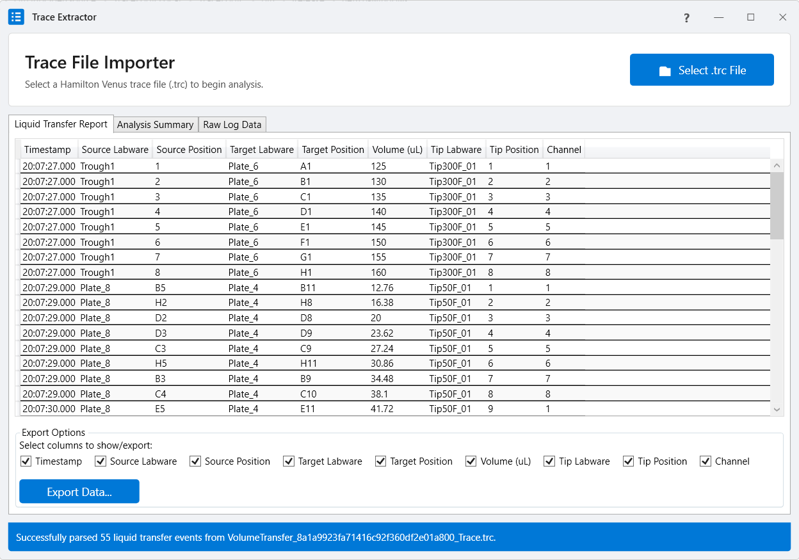

# TraceLogic: Trace File Parser

**TraceLogic** is a .NET application and library designed to parse and extract meaningful data from Hamilton Venus trace (`.trc`) files. It translates complex, low-level log entries into a simple, high-level list of liquid transfer events, making it easy to verify and analyze liquid handling operations.

The project is composed of two main parts:
* **`Trace Extractor`**: A user-friendly desktop application for quickly loading and analyzing `.trc` files.
* **`TraceLogic.Core`**: A .NET library that contains all the core parsing logic, allowing developers to integrate trace file analysis into their own applications.



---

## Features

* **Robust Parsing**: Handles the step-by-step logic of Hamilton's `.trc` files.
* **Hierarchical Data Models**: Raw log lines (`TraceEntry`) are aggregated into logical `PipettingStep`s (aspirate/dispense).
* **GUI**: The Trace Extractor UI allows for simple drag-and-drop or file selection, with clear results and data export capabilities.
* **Programmatic Access**: The `TraceLogic.Core` library can be used independently for automated analysis pipelines.

---

## How to Use Trace Extractor (GUI)

1.  **Launch the Application**: Open the `TraceLogic.exe`.
2.  **Load a File**: Click the **Select .trc File** button or drag and drop your trace file onto the application window.
3.  **View Results**: The application will automatically parse the file. The main **Liquid Transfer Report** tab will display a list of all completed liquid transfers.
4.  **Export Data**: At the bottom, check the columns you wish to include in your report and click **Export Data...** to save the results as a CSV file.

---

## How to Use TraceLogic.Core (Library)

To use the parsing engine in your own .NET project, you can reference the `TraceLogic.Core.dll`.

### Example Usage:

Here is a basic example of how to parse a file and access the liquid transfer events.

```csharp
using System;
using System.Linq;
using TraceLogic.Core.Models;
using TraceLogic.Core.Parsing;

public class TraceLogicExample
{
    public static void Main(string[] args)
    {
        // The actual parser class is TraceFileParser
        var parser = new TraceFileParser();

        string filePath = "C:\\path\\to\\your\\assay_run.trc";

        try
        {
            // The parsing method is .Parse()
            TraceAnalysisResult result = parser.Parse(filePath);

            if (result.Errors.Any())
            {
                Console.WriteLine("Errors encountered during parsing:");
                foreach (var error in result.Errors)
                {
                    Console.WriteLine($"- {error}");
                }
            }

            Console.WriteLine($"Successfully parsed {result.LiquidTransfers.Count} liquid transfer events.");

            // Iterate over the high-level transfer events
            foreach (var transfer in result.LiquidTransfers)
            {
                Console.WriteLine(
                    $"Time: {transfer.Timestamp:HH:mm:ss}, " +
                    $"Channel: {transfer.ChannelId}, " +
                    $"Volume: {transfer.Volume}uL, " +
                    $"From: {transfer.SourceLabware} [{transfer.SourcePositionId}], " +
                    $"To: {transfer.TargetLabware} [{transfer.TargetPositionId}]"
                );
            }
        }
        catch (Exception ex)
        {
            Console.WriteLine($"An unexpected error occurred: {ex.Message}");
        }
    }
}
```

---

## Building from Source

### Prerequisites

* [.NET 8 SDK (or newer)](https://dotnet.microsoft.com/download)
* [Visual Studio 2022](https://visualstudio.microsoft.com/)

### Instructions

1.  **Clone the repository:**
    ```sh
    git clone [https://github.com/VerisFlow/TraceLogic.git](https://github.com/VerisFlow/TraceLogic.git)
    ```
2.  **Navigate to the directory:**
    ```sh
    cd TraceLogic
    ```
3.  **Build the solution:**
    * **Using Visual Studio**: Open the `TraceLogic.sln` file and build the solution (Build > Build Solution).
    * **Using .NET CLI**: Run the build command from the root directory.
        ```sh
        dotnet build
        ```
The executables will be located in the respective `bin/Debug` or `bin/Release` folders.

---

## Project Structure

* `TraceLogic/`: The solution root.
* `TraceLogic.Core/`: The core class library containing all parsing logic and data models. This project is platform-agnostic.
* `TraceLogic/`: The WPF/WinForms desktop application project that provides the GUI.